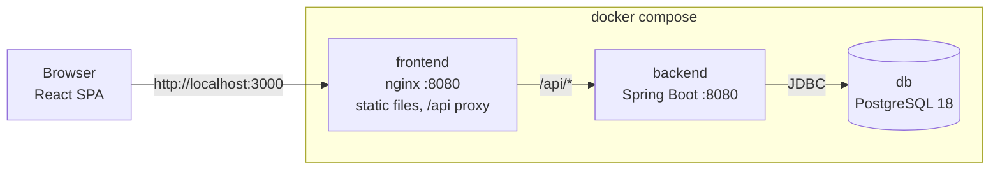
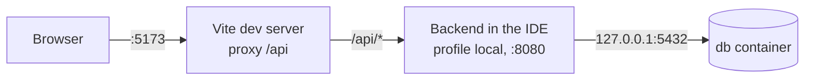
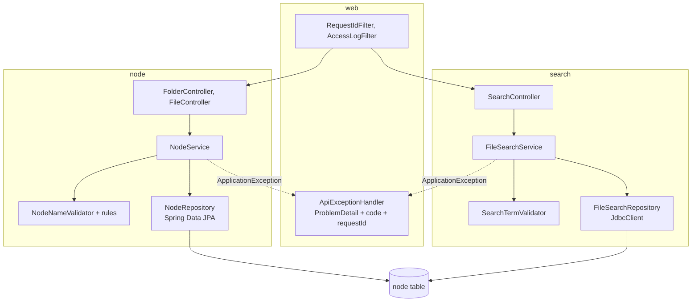
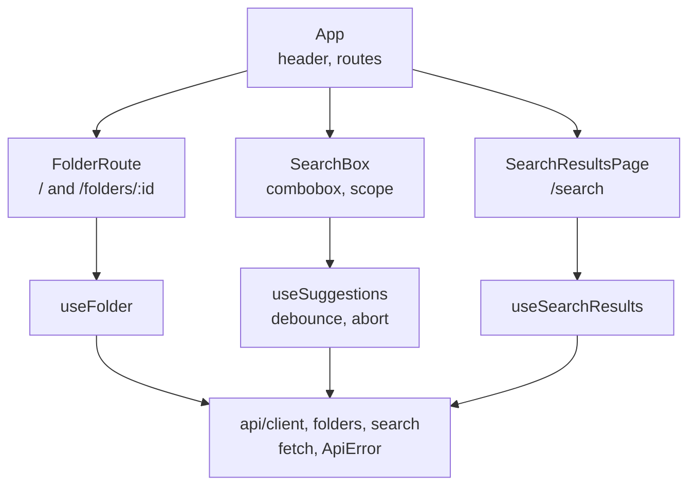

# Architecture

## Runtime with Docker Compose

```mermaid
flowchart LR
    browser["Browser<br/>React SPA"]
    subgraph compose["docker compose"]
        nginx["frontend<br/>nginx :8080<br/>static files, /api proxy"]
        backend["backend<br/>Spring Boot :8080"]
        db[("db<br/>PostgreSQL 18")]
    end
    browser -->|"http://localhost:3000"| nginx
    nginx -->|"/api/*"| backend
    backend -->|JDBC| db
```

## Runtime during development

```mermaid
flowchart LR
    browser["Browser"] -->|":5173"| vite["Vite dev server<br/>proxy /api"]
    vite -->|"/api/*"| backend["Backend in the IDE<br/>profile local, :8080"]
    backend -->|"127.0.0.1:5432"| db[("db container")]
```

## Backend packages

```mermaid
flowchart TB
    subgraph webLayer["web"]
        filters["RequestIdFilter, AccessLogFilter"]
        handler["ApiExceptionHandler<br/>ProblemDetail + code + requestId"]
    end
    subgraph nodeFeature["node"]
        nodeApi["FolderController, FileController"]
        nodeService["NodeService"]
        nodeValidator["NodeNameValidator + rules"]
        nodeRepo["NodeRepository<br/>Spring Data JPA"]
    end
    subgraph searchFeature["search"]
        searchApi["SearchController"]
        searchService["FileSearchService"]
        searchValidator["SearchTermValidator"]
        searchRepo["FileSearchRepository<br/>JdbcClient"]
    end
    db[("node table")]

    filters --> nodeApi
    filters --> searchApi
    nodeApi --> nodeService
    nodeService --> nodeValidator
    nodeService --> nodeRepo
    searchApi --> searchService
    searchService --> searchValidator
    searchService --> searchRepo
    nodeRepo --> db
    searchRepo --> db
    nodeService -. ApplicationException .-> handler
    searchService -. ApplicationException .-> handler
```

## Frontend components

```mermaid
flowchart TB
    app["App<br/>header, routes"]
    searchBox["SearchBox<br/>combobox, scope"]
    folderRoute["FolderRoute<br/>/ and /folders/:id"]
    results["SearchResultsPage<br/>/search"]
    useFolder["useFolder"]
    useSuggestions["useSuggestions<br/>debounce, abort"]
    useResults["useSearchResults"]
    api["api/client, folders, search<br/>fetch, ApiError"]

    app --> searchBox
    app --> folderRoute
    app --> results
    searchBox --> useSuggestions
    folderRoute --> useFolder
    results --> useResults
    useFolder --> api
    useSuggestions --> api
    useResults --> api
```
