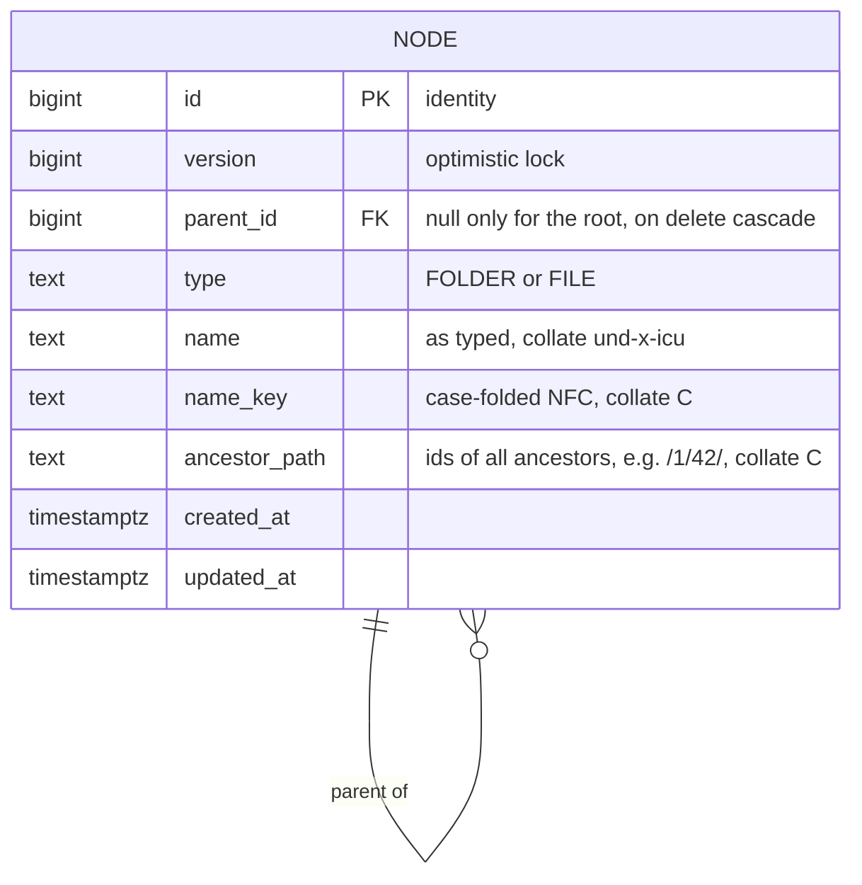

# Data model

## Table `node` for folders and files

```mermaid
erDiagram
    NODE ||--o{ NODE : "parent of"
    NODE {
        bigint id PK "identity"
        bigint version "optimistic lock"
        bigint parent_id FK "null only for the root, on delete cascade"
        text type "FOLDER or FILE"
        text name "as typed, collate und-x-icu"
        text name_key "case-folded NFC, collate C"
        text ancestor_path "ids of all ancestors, e.g. /1/42/, collate C"
        timestamptz created_at
        timestamptz updated_at
    }
```
