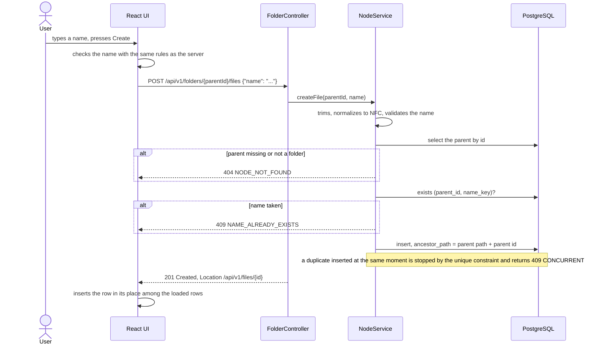
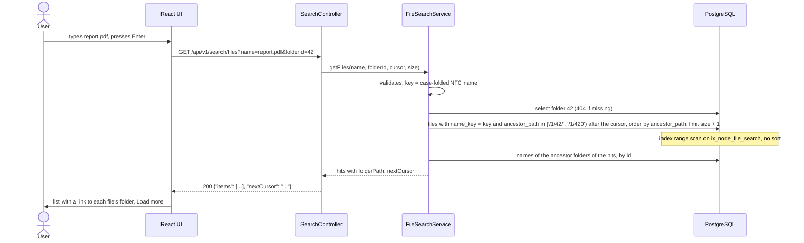
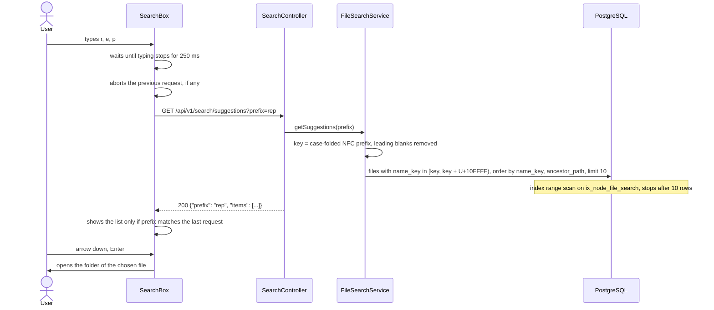
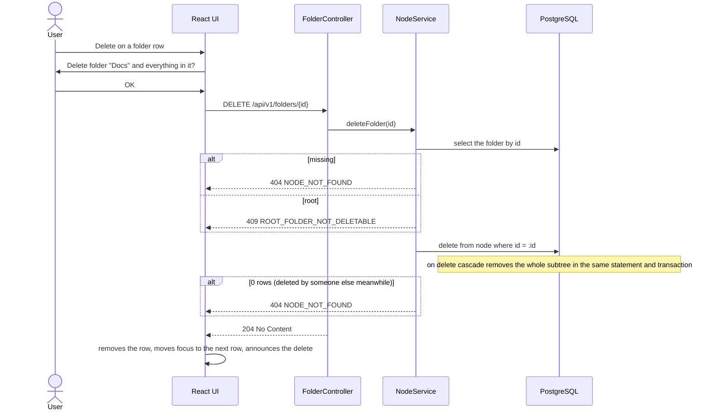

# Request flows

## Create a file

```mermaid
sequenceDiagram
    actor User
    participant UI as React UI
    participant API as FolderController
    participant Service as NodeService
    participant DB as PostgreSQL

    User->>UI: types a name, presses Create
    UI->>UI: checks the name with the same rules as the server
    UI->>API: POST /api/v1/folders/{parentId}/files {"name": "..."}
    API->>Service: createFile(parentId, name)
    Service->>Service: trims, normalizes to NFC, validates the name
    Service->>DB: select the parent by id
    alt parent missing or not a folder
        Service-->>UI: 404 NODE_NOT_FOUND
    end
    Service->>DB: exists (parent_id, name_key)?
    alt name taken
        Service-->>UI: 409 NAME_ALREADY_EXISTS
    end
    Service->>DB: insert, ancestor_path = parent path + parent id
    Note over Service,DB: a duplicate inserted at the same moment is stopped by the unique constraint and returns 409 CONCURRENT_CHANGE
    API-->>UI: 201 Created, Location /api/v1/files/{id}
    UI->>UI: inserts the row in its place among the loaded rows
```

## Search by exact name

```mermaid
sequenceDiagram
    actor User
    participant UI as React UI
    participant API as SearchController
    participant Service as FileSearchService
    participant DB as PostgreSQL

    User->>UI: types report.pdf, presses Enter
    UI->>API: GET /api/v1/search/files?name=report.pdf&folderId=42
    API->>Service: getFiles(name, folderId, cursor, size)
    Service->>Service: validates, key = case-folded NFC name
    Service->>DB: select folder 42 (404 if missing)
    Service->>DB: files with name_key = key and ancestor_path in ['/1/42/', '/1/420') after the cursor, order by ancestor_path, limit size + 1
    Note over DB: index range scan on ix_node_file_search, no sort
    Service->>DB: names of the ancestor folders of the hits, by id
    Service-->>API: hits with folderPath, nextCursor
    API-->>UI: 200 {"items": [...], "nextCursor": "..."}
    UI->>User: list with a link to each file's folder, Load more
```

## Suggestions while typing

```mermaid
sequenceDiagram
    actor User
    participant UI as SearchBox
    participant API as SearchController
    participant Service as FileSearchService
    participant DB as PostgreSQL

    User->>UI: types r, e, p
    UI->>UI: waits until typing stops for 250 ms
    UI->>UI: aborts the previous request, if any
    UI->>API: GET /api/v1/search/suggestions?prefix=rep
    API->>Service: getSuggestions(prefix)
    Service->>Service: key = case-folded NFC prefix, leading blanks removed
    Service->>DB: files with name_key in [key, key + U+10FFFF), order by name_key, ancestor_path, limit 10
    Note over DB: index range scan on ix_node_file_search, stops after 10 rows
    API-->>UI: 200 {"prefix": "rep", "items": [...]}
    UI->>UI: shows the list only if prefix matches the last request
    User->>UI: arrow down, Enter
    UI->>User: opens the folder of the chosen file
```

## Delete a folder

```mermaid
sequenceDiagram
    actor User
    participant UI as React UI
    participant API as FolderController
    participant Service as NodeService
    participant DB as PostgreSQL

    User->>UI: Delete on a folder row
    UI->>User: Delete folder "Docs" and everything in it?
    User->>UI: OK
    UI->>API: DELETE /api/v1/folders/{id}
    API->>Service: deleteFolder(id)
    Service->>DB: select the folder by id
    alt missing
        Service-->>UI: 404 NODE_NOT_FOUND
    else root
        Service-->>UI: 409 ROOT_FOLDER_NOT_DELETABLE
    end
    Service->>DB: delete from node where id = :id
    Note over DB: on delete cascade removes the whole subtree in the same statement and transaction
    alt 0 rows (deleted by someone else meanwhile)
        Service-->>UI: 404 NODE_NOT_FOUND
    end
    API-->>UI: 204 No Content
    UI->>UI: removes the row, moves focus to the next row, announces the delete
```
